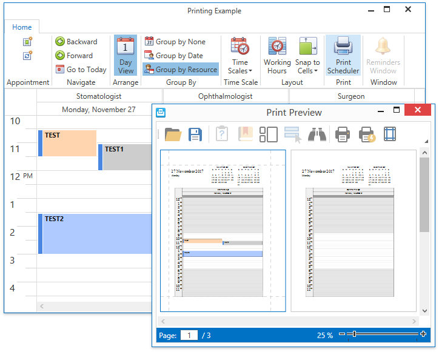

<!-- default badges list -->

<!-- default badges end -->

# WPF Scheduler - Use Scheduler Report to Print and Export Appointments

This example demonstrates how to print and export the Scheduler control. The **Print Scheduler** ribbon button loads the Scheduler Report template and invokes the [Document Preview](https://docs.devexpress.com/XtraReports/15016/wpf-reporting/wpf-reporting-document-preview) window. This window allows users to print the report or export it to PDF.

## Files to Review

* [MainWindow.xaml](./CS/PrintingExample/MainWindow.xaml)
* [MainWindow.xaml.cs](./CS/PrintingExample/MainWindow.xaml.cs) (VB: [MainWindow.xaml.vb](./VB/PrintingExample/MainWindow.xaml.vb))
* [MyPrintHelper.cs](./CS/PrintingExample/MyPrintHelper.cs) (VB: [MyPrintHelper.vb](./VB/PrintingExample/MyPrintHelper.vb))
* [MainViewModel.cs](./CS/PrintingExample/ViewModel/MainViewModel.cs) (VB: [MainViewModel.vb](./VB/PrintingExample/ViewModel/MainViewModel.vb))

## Documentation

* [Printing](https://docs.devexpress.com/WPF/119773/controls-and-libraries/scheduler/printing)
* [Print a Scheduler from a Document Preview Window](https://docs.devexpress.com/WPF/119770/controls-and-libraries/scheduler/examples/how-to-print-a-scheduler-using-reports-from-a-document-preview-window)
* [Printing Templates](https://docs.devexpress.com/WPF/400666/controls-and-libraries/scheduler/printing-templates)
